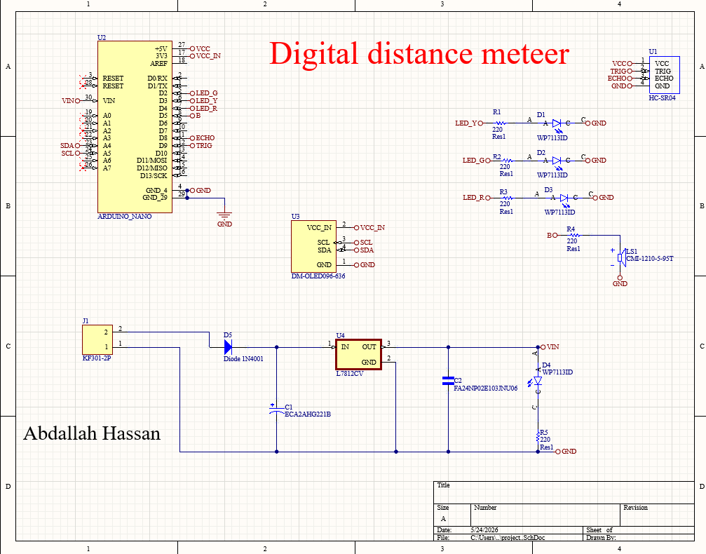
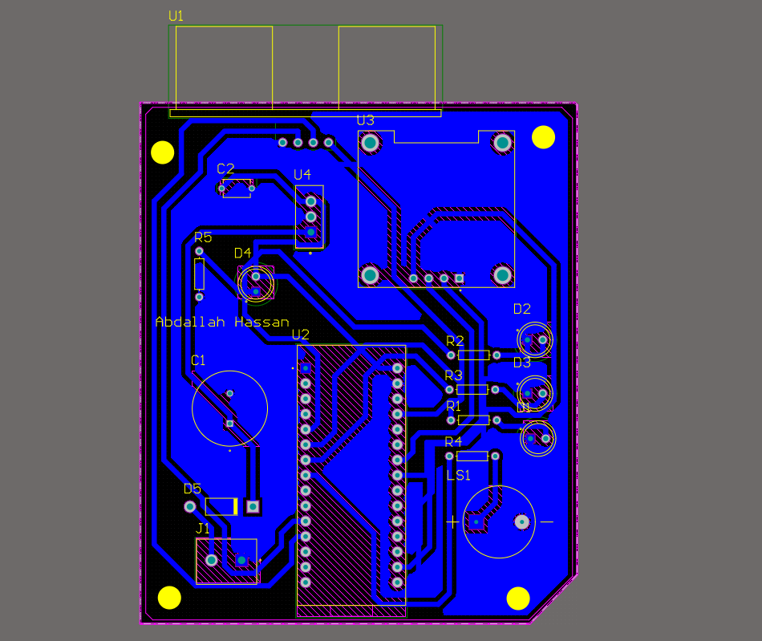
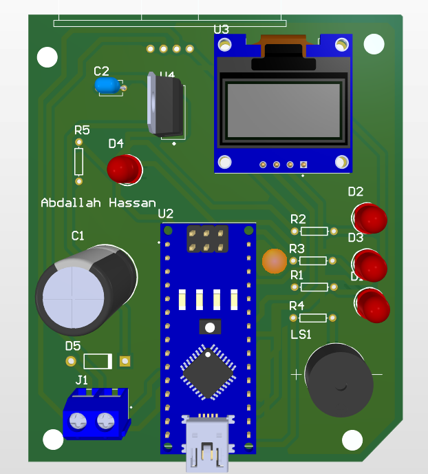
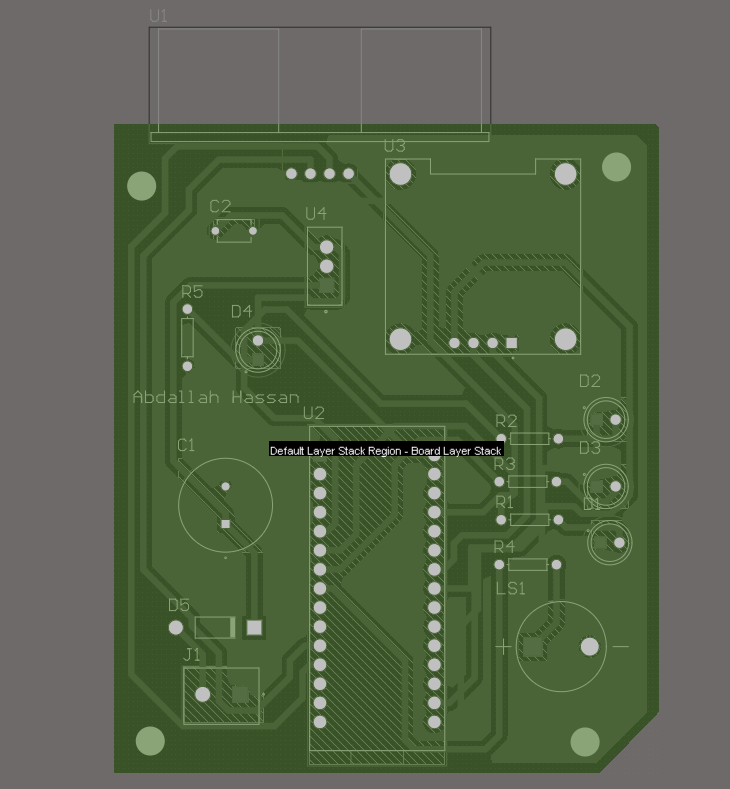

# Arduino HC-SR04 Distance Meter PCB

## Overview
A PCB-based digital distance meter designed using Altium Designer.

## Components
- Arduino Nano
- HC-SR04 Ultrasonic Sensor
- OLED Display
- LEDs
- Buzzer
- LM7805 Voltage Regulator
- Embedded Power Supply Circuit

## Features
- Distance measurement using ultrasonic sensor
- OLED display output
- LED distance indication
- Audio alert using buzzer
- Proteus simulation
- Complete PCB design

## Project Structure
- Arduino-Code: Arduino source code
- Proteus-Simulation: Proteus simulation files
- Altium-PCB: Schematic and PCB design files
- Project-Images: Project screenshots and PCB previews

## Design Software
- Altium Designer
- Proteus
- Arduino IDE

## Project Images

### Schematic Design

### PCB Layout

### 3D PCB View

### Board Stack View

